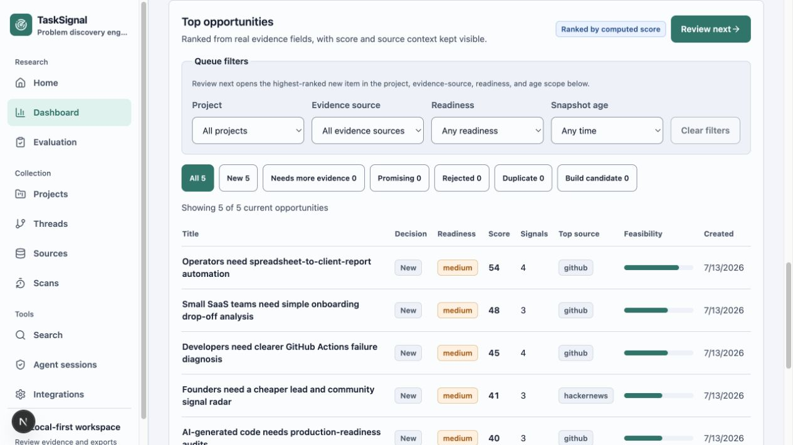
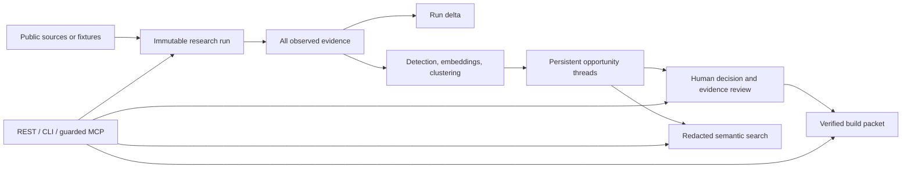

# TaskSignal — Local Evidence-to-Build Workbench

TaskSignal helps an indie builder turn repeated public problem research into an
evidence-traceable build package for a local coding agent.

It remembers what each run observed, explains what changed, keeps related
opportunities in persistent threads, and generates deterministic build documents
whose provenance can be verified before implementation starts.



## Project Status

TaskSignal is an early-stage, local-first application for one operator. The
latest public release is the [`v0.2.0` rollback baseline](https://github.com/Yurii201811/tasksignal/releases/tag/v0.2.0).
The current source tree is the pre-GA v1 alpha (`1.0.0a1` for Python and
`1.0.0-alpha.1` for the web app).

The repository has a passing Linux/macOS Python 3.11–3.14 wheel matrix in this
[`main` CI run](https://github.com/Yurii201811/tasksignal/actions/runs/29171023301).
PyPI publication and independent usability validation are not claimed yet. The
hosted topology remains a protected single-operator preview, not a multi-user or
unattended production service.

## Prove the Complete Loop

This is the fastest credential-free path from a fresh source checkout to a
verified build packet.

Prerequisites: Python 3.11–3.14, [`uv`](https://docs.astral.sh/uv/), Node 20 or
newer, npm, and `make`.

```bash
make setup
make smoke
```

`make smoke` uses a temporary SQLite database and public fixtures. It exercises
the first run, an identical rerun with no false new thread, opportunity review,
packet creation, and manifest verification.

To keep the proof files for inspection, run:

```bash
apps/api/.venv/bin/python -u scripts/first_run_smoke.py \
  --proof-dir /tmp/tasksignal-first-run-proof
```

The proof directory includes a first-run report and summary, task pack,
build-packet ZIP, packet manifest, verification result, and top-level proof
manifest.

## Run the Full Workbench

`make dev` prints the two launch commands; it does not start either service.
Run the API and web app in separate terminals:

```bash
# Terminal 1
cd apps/api
.venv/bin/uvicorn app.main:app --reload
```

```bash
# Terminal 2
cd apps/web
npm run dev
```

Open [http://localhost:3000](http://localhost:3000), choose **Process demo
data**, and review the five current opportunity threads. Use the project,
evidence-source, readiness, snapshot-age, and decision filters to narrow the
queue. **Review next** opens the highest-ranked new item within the project,
evidence-source, readiness, and snapshot-age scope.

No environment file or credentials are needed for this fixture-backed SQLite
path. Native API overrides belong in `apps/api/.env`; web overrides belong in
`apps/web/.env.local` and use `NEXT_PUBLIC_API_BASE_URL`. The root
`.env.example` is a reference inventory, not a file loaded by either native
process.

For the loopback-only Docker Compose stack, install Docker and migrate
PostgreSQL before serving:

```bash
make migrate
make up
```

## Install the Local Python Tool

TaskSignal is not documented as published to PyPI yet. From a source checkout,
install the base API/CLI or the optional stdio MCP surface:

```bash
uv tool install './apps/api'
# Or, with guarded MCP support:
uv tool install './apps/api[mcp]'
```

Initialize a private local runtime and start the API:

```bash
tasksignal init
tasksignal migrate
tasksignal doctor
tasksignal serve
```

`tasksignal serve` stays attached to the first terminal. In a second terminal,
create and run a credential-free fixture project:

```bash
tasksignal --json projects create \
  --name "Fixture proof" \
  --source-type fixture \
  --query "workflow"
tasksignal projects run <project-id-from-the-create-response>
tasksignal runs list <project-id-from-the-create-response>
```

`init` creates platform-specific data/config paths and a permission-`0600`
secret file without printing secret values. `migrate` backs up SQLite before an
upgrade and refuses to guess the lineage of a nonempty unversioned schema.
`serve` refuses a stale schema and binds only to loopback.

API-backed commands are grouped under `projects`, `runs`, `opportunities`,
`evidence`, `packets`, and `sessions`; `--json` emits one stable machine-readable
envelope. The Python wheel contains the FastAPI app, CLI, Alembic migrations,
and public fixtures. It does not contain the Next.js UI.

See [Packaged installation](docs/packaged-installation.md) and the [CLI
reference](docs/cli.md) for migration boundaries and command details.

## What v1 Adds

- **Longitudinal research memory.** Every saved-project run records its source,
  query, limit, scan linkage, and every observed normalized item. An identical
  rerun stays auditable without duplicating evidence.
- **Precise run deltas.** Evidence, signals, and threads are described as `new`,
  `seen before`, `updated`, `unchanged`, or `not observed this run`. Absence
  never means deletion or resolution.
- **Persistent opportunity threads.** Snapshots match only within the same
  project. Ambiguous results start a new thread, and a human can detach an
  incorrect automatic match.
- **Focused review queue.** The dashboard shows one current snapshot per thread,
  supports server-side queue filters, and keeps the next review action inside
  the active scope.
- **Typed semantic search.** REST, CLI, and MCP share a retrieval service that
  returns bounded evidence excerpts and related threads with readiness, review
  state, scores, and provenance—never raw source JSON, author hashes, local
  notes, connector configuration, or credentials.
- **Public Discourse research.** Each forum requires terms confirmation for one
  exact HTTPS origin. The connector rejects IP literals, non-public DNS results,
  and cross-host redirects and does not support cookies or credentials.
- **Immutable build packets.** An eligible thread produces ten authoritative
  deterministic files with byte counts, SHA-256 hashes, run/thread/snapshot IDs,
  and generation metadata.
- **Guarded stdio MCP.** Reads work immediately. Six non-destructive write tools
  require process-bound approval, idempotency keys, expected-version checks, and
  an append-only redacted audit. AI-backed packet enhancement needs a separate
  capability approval.

No paid model is required. Deterministic fixtures, vectors, clustering, and
documents are the authoritative default path. REST clients should use canonical
`/api/v1`; `/api` remains a compatibility alias throughout v1.x.

## Evidence-to-Build Flow



The thread matcher checks an exact evidence-set hash first. Otherwise, and only
when embedding model and backend identifiers match, it computes:

```text
0.60 * centroid similarity
+ 0.25 * evidence Jaccard
+ 0.15 * normalized-title Jaccard
```

It auto-matches at `>= 0.82` only when the next-best candidate is at least
`0.05` lower. Multiple exact matches or a narrower similarity margin are
ambiguous and create a new thread.

## Build Packets

A packet can be created only from a `build_candidate` thread with medium or
strong evidence readiness and no current `sensitive_risk`. Its authoritative
root contains exactly:

```text
README.md
MANIFEST.json
opportunity.json
evidence.md
task-pack.md
product-requirements.md
validation-plan.md
github-issue.md
implementation-plan.md
agent-brief.md
```

`MANIFEST.json` identifies the TaskSignal and schema versions, project, run,
thread, snapshot, decision provenance, generation mode, timestamp, byte counts,
and SHA-256 hashes for the other nine files. Verification rejects missing,
unexpected, or modified content. The manifest is not recursively self-hashed;
its digest is stored with the packet record.

Configured OpenAI or Ollama enhancement may add six validated `enhanced/`
variants. The ten deterministic root files remain complete and authoritative,
and fallback is recorded when enhancement is unavailable or invalid. Public
evidence is treated as untrusted quoted data, never as instructions. Local
decision notes, raw identities, connector payloads, and secrets are excluded.
`github-issue.md` is a draft; TaskSignal does not create GitHub issues.

## Guarded MCP

Install the `mcp` extra, initialize and migrate the local runtime, then run:

```bash
tasksignal mcp
```

The server uses stdio only. It exposes eight reads (`list_projects`,
`list_project_runs`, `compare_project_runs`, `search_opportunities`,
`get_opportunity_thread`, `get_evaluation`, `get_build_packet`, and
`verify_build_packet`) and six writes (`create_project`, `update_project`,
`run_project`, `set_opportunity_decision`, `append_evidence_label`, and
`create_build_packet`).

One process registers one session. Its raw secret stays in process memory while
the database stores only a hash. A 30-second heartbeat and 60-second lease expire
approval after two missed heartbeats. Every write requires an idempotency key and
expected version; conflicts are structured instead of overwriting concurrent
work. Agent labels stay distinct from human labels and do not grade agent output.

MCP intentionally excludes deletion/reset, credentials, source-host
authorization, retention changes, arbitrary URL fetching, shell/filesystem
operations, HTTP transport/OAuth, and direct GitHub writes.

## Public Sources

TaskSignal supports fixtures, Reddit, Hacker News, GitHub Issues, Stack Exchange,
and explicitly authorized public Discourse forums. There is no third-party
connector plugin API in v1.

Connector credentials belong in environment variables, not source registry
records:

- `REDDIT_CLIENT_ID`, `REDDIT_CLIENT_SECRET`, `REDDIT_USER_AGENT`
- `GITHUB_TOKEN`
- `STACK_EXCHANGE_KEY`

Hacker News and fixtures are the default unauthenticated public scan surface.
Credentialed source runs, Discourse runs, source mutations, and configured-model
operations require the local operator-token boundary described in the [API
reference](docs/api.md). Discourse supports public forums only: no cookies,
private categories, user credentials, or cross-origin redirects.

Optional enhancement uses `LLM_PROVIDER=openai` plus `OPENAI_API_KEY`, or
`LLM_PROVIDER=ollama` plus a reachable local Ollama server. ChatGPT and Codex
subscriptions are not backend API credentials.

## Development and Verification

```bash
make doctor
make test
make lint
make verify
make smoke
make package-check
make release-check
```

`make smoke` exercises the credential-free fixture path against a temporary
database. `make package-check` builds and tests the distribution in isolation.
The passing [`main` matrix run](https://github.com/Yurii201811/tasksignal/actions/runs/29171023301)
installs the built wheel on Python 3.11–3.14 on Linux and macOS.

The base and `mcp` dependency surfaces are the release-audited Python package
scope. The optional `ml` extra adds sentence-transformers, scikit-learn, and
their transitive dependencies; assess and audit that extra separately before
enabling it.

## Privacy, Limits, and Intended Use

TaskSignal is for indie builders, maintainers, developer-tool teams, and
researchers who want a local evidence trail before deciding what to build. It is
not for private-community scraping, individual profiling, spam, bulk outreach,
or replacing human product judgment.

TaskSignal stores author hashes instead of raw usernames by default and redacts
public search, packet, MCP, and audit surfaces. The local database can still
contain source material and local notes, so protect its data directory and do
not expose the single-operator API as a team service.

Quoted source text can contain prompt-injection-shaped instructions. Treat it as
evidence only. Before enabling live connectors, review [Data ethics](docs/data-ethics.md),
[Source limits and terms](docs/source-limits.md), and the [Threat
model](docs/threat-model.md).

## Scoring

```text
opportunity_score =
  0.25 * frequency_score
+ 0.20 * recency_score
+ 0.20 * pain_intensity_score
+ 0.15 * task_concreteness_score
+ 0.10 * buying_intent_score
+ 0.10 * feasibility_score
- 0.10 * competition_penalty
```

Scoring and human review support a build decision; they do not establish market
validation, recall, or product success.

## Reference

- [Architecture](docs/architecture.md)
- [API](docs/api.md)
- [CLI](docs/cli.md)
- [Packaged installation](docs/packaged-installation.md)
- [Deployment](docs/deployment.md)
- [Roadmap](docs/roadmap.md)
- [Changelog](CHANGELOG.md)
- [Contributing](CONTRIBUTING.md)
- [Security policy](SECURITY.md)
- [License](LICENSE)
