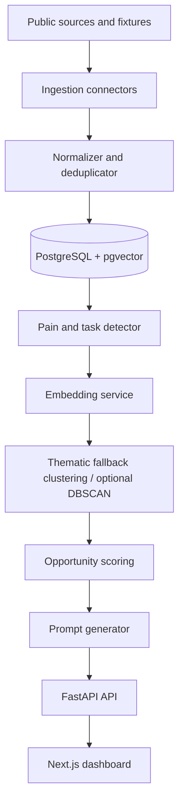

# TaskSignal - AI Problem Discovery Engine

From Reddit/forum complaints → evidence-backed project ideas → build-ready Codex prompts.

TaskSignal is an AI-assisted engine that mines public developer and community discussions, detects concrete repetitive tasks people complain about, clusters similar pain signals, scores software opportunities, and generates Codex-ready MVP prompts.


## Project Status

TaskSignal is a portfolio-ready MVP built by Yurii Bakurov. It is designed for one local operator on their own machine: fixture data works out of the box, a local workspace profile stores that user's research defaults, and repeatable API-backed workflows can be enabled for supported public sources when credentials are provided.

Current public posture: TaskSignal is an early public application repository, not a widely adopted package. The current `v0.2.0` release candidate combines the decision workbench, refreshed accessible UI, locked design-token exports, test-only `httpx2` support, and upstream redaction hardening. It is prepared for public release, but it is not externally published until the matching Git tag and GitHub Release exist. See the [demo evidence snapshot](docs/demo-evidence.md) and [release checklist](docs/release-prep.md) for the candidate evidence boundary.

Useful starting points:

- [Product context](PRODUCT.md)
- [Architecture](docs/architecture.md)
- [API reference](docs/api.md)
- [Demo evidence snapshot](docs/demo-evidence.md)
- [Deployment notes](docs/deployment.md)
- [Data ethics](docs/data-ethics.md)
- [Source limits and terms](docs/source-limits.md)
- [Model card](docs/model-card.md)
- [Roadmap](docs/roadmap.md)
- [Threat model](docs/threat-model.md)
- [Maintainer automation plan](docs/maintainer-automation.md)
- [Codex for OSS application evidence](docs/codex-for-oss-application.md)
- [Changelog](CHANGELOG.md)
- [Contributing guide](CONTRIBUTING.md)
- [Security policy](SECURITY.md)

## Why This Exists

Most idea lists are generic. TaskSignal is a task-replacement radar: it looks for specific repeated workflows people hate doing, such as exporting Stripe data into a spreadsheet every Friday and turning it into a client report.

## Who Should Use This

TaskSignal is for maintainers, builders, indie hackers, developer-tool teams, and researchers who want a local-first way to review public pain signals before deciding what to build. It is not for scraping private communities, profiling individuals, spam, outreach automation, or replacing human product judgment.

## What It Does

- Loads demo fixture data with no API keys.
- Stores one local workspace profile with owner/focus/default research settings.
- Saves repeatable research projects with source, query, limit, labels, cadence, last run, next run, and run count.
- Reports integration readiness without exposing secret values.
- Records scan outcomes with found/saved items, detected signals, generated opportunities, and guidance when live data produces no ranked opportunity.
- Normalizes Reddit, Hacker News, GitHub Issues, Stack Exchange, and fixture-style records.
- Stores author hashes instead of raw usernames by default.
- Detects complaints, manual workflows, tool requests, workarounds, buying intent, and confusion.
- Generates local embeddings with `sentence-transformers/all-MiniLM-L6-v2` when the optional ML extra and model cache are available.
- Falls back to deterministic local vectors when the model is unavailable.
- Clusters signals with a local thematic fallback by default, with optional DBSCAN when `TASKSIGNAL_USE_SKLEARN_CLUSTERING=1`.
- Scores opportunities using frequency, recency, pain, concreteness, buying intent, feasibility, and competition penalty.
- Generates opportunity cards, full Codex-ready build prompts, and richer Codex task packs.
- Stores one explicit decision state and an export-excluded local note for each opportunity.
- Keeps evidence reviews append-only and preserves legacy label history without treating unknown labels as current recognized reviews.
- Reports evidence readiness from evidence count, source diversity, safe URL coverage, and human review coverage.
- Shows selection-biased review coverage and precision on reviewed positives without claiming recall, F1, or market validation.
- Optionally enhances generated prompts through OpenAI API or local Ollama when explicitly configured.

## Architecture



## Tech Stack

Frontend: Next.js, TypeScript, Tailwind CSS, TanStack Query, Recharts, React Markdown, Zod-ready types.

Backend: FastAPI, Pydantic v2, SQLAlchemy 2, Alembic, PostgreSQL, pgvector, pytest, and ruff.

ML/NLP: deterministic vectors and thematic clustering by default, with an optional `ml` extra for sentence-transformers and DBSCAN, plus a rule-based signal detector.

Infra: Docker Compose, Makefile, GitHub Actions CI, scheduled ingestion template.

## Quickstart

```bash
make setup
cp .env.example .env
make doctor
make dev
```

`make dev` prints ready-to-run API and Node-safe web commands. Run each printed
command in a separate terminal.

`make setup` installs the lean deterministic runtime. Use `make setup-ml` when
this machine should also install sentence-transformers and scikit-learn for a
locally cached embedding model and opt-in DBSCAN clustering.

For the loopback-only Docker Compose stack, migrate the PostgreSQL schema before
serving it:

```bash
cp .env.example .env
make migrate
make up
```

The repository-root `.env` is a `make doctor` input only: the native API and
Next.js do not automatically load it, and the current Compose file does not
inject it. For native API settings, use `apps/api/.env` or export values in the
API terminal. For non-default web settings, use `apps/web/.env.local` or export
`NEXT_PUBLIC_API_BASE_URL` in the web terminal. For Compose, use explicit
service environment entries or a Compose override.

Open the frontend at [http://localhost:3000](http://localhost:3000), go to Projects, save a research workflow, then run it. For a first proof path, go to Dashboard and click **Process demo data**. To use live public data, choose a source, query, and limit in **Live source**, then click **Run scan**.

If setup fails or a fresh checkout looks incomplete, run:

```bash
make doctor
```

`make doctor` checks the required files, local `.env`, Python, Node 20+, npm,
repo-local Python dev tools, fixture files, and whether generated files are
accidentally tracked. Docker is only required for the Compose quickstart.

API health check:

```bash
curl http://localhost:8000/health
```

## Local Development

Run checks before publishing changes:

```bash
make test
make lint
make verify
```

The Makefile prefers repo-local Python tools in `apps/api/.venv/bin`. On Apple
Silicon macOS it also prepends Homebrew Node 20 from
`/opt/homebrew/opt/node@20/bin` when available, matching the runtime required by
the Next.js web app.

Run the release-readiness gate before tagging a release:

```bash
make release-check
```

Run the first-run smoke check to verify the credential-free fixture path against
a temporary database, including dashboard route wiring, task-pack export, and
task-pack contract validation:

```bash
make smoke
```

To save a reviewer-friendly Markdown proof from the same run:

```bash
apps/api/.venv/bin/python -u scripts/first_run_smoke.py --proof-out first-run-proof.md
```

To save a complete reviewer bundle with the Markdown proof, machine-readable
summary, top opportunity task pack, and artifact manifest:

```bash
apps/api/.venv/bin/python -u scripts/first_run_smoke.py --proof-dir first-run-proof-bundle
```

To verify a saved proof bundle's manifest, file sizes, hashes, and top-level
contents without rerunning smoke:

```bash
apps/api/.venv/bin/python -u scripts/first_run_smoke.py --verify-proof-dir first-run-proof-bundle
```

To also boot the Next.js dev server and request `/dashboard`, run:

```bash
apps/api/.venv/bin/python -u scripts/first_run_smoke.py --with-web-server
```

Use the local CLI for headless operation:

```bash
scripts/tasksignal_cli.py readiness
scripts/tasksignal_cli.py configure-workspace --owner "Local Builder" --goal "Find developer-tool opportunities" --source hackernews --query ask --cadence daily
scripts/tasksignal_cli.py create-project --name "Track CI/CD pain" --source hackernews --query ask --cadence daily
scripts/tasksignal_cli.py run-due
scripts/tasksignal_cli.py task-pack <opportunity-id> --output task-pack.md
```

TaskSignal does not require multi-user accounts for this local mode. The local
workspace profile is a singleton in the app database and is meant for the person
running the app on that machine.

## Distribution

TaskSignal is currently an application repository, not a published Python or npm library. Use the source checkout or Docker Compose workflow above. Reusable packages may be split out later if a stable library boundary emerges.

## Reviewer Quick Check

For a quick public review, inspect:

- [`v0.2.0` release candidate notes](CHANGELOG.md#020---2026-07-11)
- [Published releases](https://github.com/Yurii201811/tasksignal/releases)
- [Open contributor issues](https://github.com/Yurii201811/tasksignal/issues)
- [Release-readiness workflow](https://github.com/Yurii201811/tasksignal/actions/workflows/release-check.yml)
- [Demo evidence snapshot](docs/demo-evidence.md)
- [Threat model](docs/threat-model.md)

## Repository Layout

```text
apps/api      FastAPI backend, ML pipeline, database models, tests
apps/web      Next.js dashboard, opportunity views, prompt export UI
data          Demo fixtures for local-first processing
docs          Architecture, API, deployment, ethics, and model notes
notebooks     Classifier training and evaluation workbooks
```

## Fixture Demo Mode

Fixture mode is the default. It loads records from `data/fixtures`, processes them end to end, and should generate at least five opportunity cards:

- AI-generated code audit tool
- Early-stage SaaS lead/community signal radar
- Simple onboarding drop-off analyzer
- GitHub Actions workflow debugging assistant
- Spreadsheet-to-report automation helper

## API Connector Setup

Live scans use official APIs and keep the same local-first scoring/generation pipeline as fixture mode. The unauthenticated `POST /api/scans` endpoint is restricted to public API-safe sources (`fixture` and `hackernews`) so network callers cannot spend server-side credentials or retrieve data visible to server-side tokens.

Trusted operators can still configure the internal connector pipeline with source credentials when running controlled jobs outside the public endpoint:

- `REDDIT_CLIENT_ID`, `REDDIT_CLIENT_SECRET`, `REDDIT_USER_AGENT`
- `GITHUB_TOKEN`
- `STACK_EXCHANGE_KEY`

Hacker News works without credentials through the public Firebase API. GitHub and Stack Exchange can run without keys at lower rate limits. Reddit requires OAuth credentials. No paid LLM key is required. `LLM_PROVIDER=none` is the default.

Connector credentials belong in environment variables, not source registry
records. Source registry write endpoints require `OPERATOR_SCAN_TOKEN`, reject
secret-like `config_json` keys, and read endpoints return redacted config so
local rows cannot expose token values.

`PUBLIC_SCAN_SOURCES` can narrow the public endpoint further, for example to `hackernews` only. Credentialed sources such as GitHub, Reddit, and Stack Exchange stay reserved for trusted internal scan jobs.

Browser-triggered runs of credentialed sources are available through saved
research projects only when `OPERATOR_SCAN_TOKEN` is configured on the API and
the same token is entered locally in the Projects or Integrations page. This
keeps hosted deployments from silently spending server-side credentials while
still letting trusted local operators connect APIs.

Saved projects support manual, hourly, daily, weekly, and custom-hour cadences.
TaskSignal does not hide a scheduler inside the web process. Run due projects
from the Projects page, `scripts/tasksignal_cli.py run-due`, cron, GitHub
Actions, or another explicit worker.

Optional prompt enhancement uses `LLM_PROVIDER=openai` plus `OPENAI_API_KEY`, or
`LLM_PROVIDER=ollama` plus a local Ollama server. Browser-triggered enhancement
requires `OPERATOR_SCAN_TOKEN` on the API and the matching
`X-Operator-Scan-Token` request header so network callers cannot spend
server-side model credentials. ChatGPT/Codex subscriptions do not provide
backend API credentials; TaskSignal supports subscription users by exporting
task packs they can open in their own signed-in Codex app, CLI, IDE extension,
or Codex web session.

Destructive fixture resets require `DEMO_RESET_TOKEN` and the matching `X-Demo-Reset-Token` request header. The normal dashboard demo-processing action is non-destructive by default.

## Codex And Agent Handoff

Each opportunity can export:

- A generated Codex prompt.
- An evidence bundle.
- A Codex task pack with objective, suggested MVP, score, evidence, acceptance
  criteria, privacy constraints, and recommended Codex flow.

Task packs are designed for users who want to use their own signed-in Codex app,
CLI, IDE extension, or Codex web session. They do not spend ChatGPT/Codex plan
usage from the TaskSignal backend. A repo-local skill package is available at
`skills/tasksignal-opportunity-builder` for agents that can load Codex-style
skills.

## ML/NLP Approach

The MVP uses transparent rules first. It scores pain phrases, repetition phrases, tool requests, buying intent, and task concreteness hints. Embeddings use `sentence-transformers/all-MiniLM-L6-v2` only when the optional `ml` extra and a local model cache are available; otherwise deterministic vectors keep the demo working.

## Scoring Formula

```text
opportunity_score =
  0.25 * frequency_score
+ 0.20 * recency_score
+ 0.20 * pain_intensity_score
+ 0.15 * task_concreteness_score
+ 0.10 * buying_intent_score
+ 0.10 * feasibility_score
- 0.10 * competition_penalty
```

## Privacy And Ethics

TaskSignal is designed for public-data research, product discovery, and learning. It does not store raw usernames by default, preserves source URLs for attribution, respects API boundaries, and should not be used for spam or harassment workflows.

Before enabling live connectors, review [Data ethics](docs/data-ethics.md), configure API credentials through environment variables or GitHub repository secrets, and avoid committing `.env` files or exported datasets.

## Example Generated Opportunity

**Developers need clearer GitHub Actions failure diagnosis**

Problem: teams spend repetitive time reading noisy CI logs, searching YAML errors, and guessing root causes.

Suggested MVP: a CI log summarizer and workflow linter that identifies likely YAML mistakes, dependency failures, and next fixes.

## Example Generated Codex Prompt

```markdown
# Build Developers need clearer GitHub Actions failure diagnosis

You are a senior full-stack engineer. Build a working MVP...
```

## Portfolio Notes

This repository demonstrates full-stack engineering, API design, Python backend development, TypeScript frontend development, PostgreSQL/pgvector modeling, ML/NLP pipelines, clustering, product scoring, privacy-conscious design, Docker, CI/CD, tests, and technical writing.

## Roadmap

- Publish and maintain tagged releases with changelog entries.
- Expand contributor-friendly fixtures, docs, and public issues.
- Add richer source scheduling and rate-limit state after privacy review.
- Add pgvector ANN search in production mode.
- Keep decision review, evidence readiness, and evaluation exports aligned as the workbench evolves.

See [Roadmap](docs/roadmap.md) for maintainer tasks, security milestones, and longer-term ideas.
