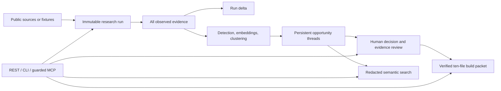

# TaskSignal — Local Evidence-to-Build Workbench

TaskSignal turns repeated public problem research into an evidence-traceable build
package for an indie builder or local coding agent.

It records what each research run observed, explains what changed, groups related
opportunity snapshots into persistent threads, and generates deterministic build
documents whose provenance can be verified before implementation starts.


## Project Status

TaskSignal is an early-stage, local-first application for one operator. The
published `v0.2.0` release is the rollback baseline. The v1 workbench described
here is implemented in the source tree and is still pre-GA: the Python
distribution is buildable and installable locally, but this README does not claim
that it has been published to PyPI, validated by independent users, or proven by
a completed cross-platform CI run.

The hosted topology remains a protected single-operator preview. TaskSignal is
not ready for accounts, tenant isolation, team collaboration, or unattended
production use.

Useful references:

- [Architecture](docs/architecture.md)
- [API reference](docs/api.md)
- [Packaged installation](docs/packaged-installation.md)
- [Deployment](docs/deployment.md)
- [Threat model](docs/threat-model.md)
- [Source limits and terms](docs/source-limits.md)
- [Data ethics](docs/data-ethics.md)
- [Roadmap](docs/roadmap.md)
- [Changelog](CHANGELOG.md)
- [Security policy](SECURITY.md)

## What v1 Adds

- **Longitudinal research memory.** Every saved-project run records its source,
  query, limit, scan linkage, and every observed normalized item. An identical
  rerun remains auditable without duplicating evidence.
- **Precise run deltas.** Evidence, signals, and opportunity threads are described
  as `new`, `seen before`, `updated`, `unchanged`, or `not observed this run`.
  Absence never means deletion or resolution.
- **Persistent opportunity threads.** New snapshots match only within the same
  project. Exact evidence hashes match immediately; compatible embeddings can
  use weighted similarity. Ambiguous results start a new thread, and a human can
  detach an incorrect automatic match.
- **Typed semantic search.** REST, CLI, and MCP share one retrieval service that
  returns bounded evidence excerpts and related threads with scores, readiness,
  review state, and provenance. It omits raw source JSON, author hashes, local
  review notes, connector configuration, and credentials.
- **Public Discourse research.** Each forum requires explicit terms confirmation
  for one exact HTTPS origin. The connector rejects IP literals, non-public DNS
  results, and cross-host redirects; it uses bounded time, response, redirect,
  and result limits and does not support cookies or credentials.
- **Immutable build packets.** An eligible `build_candidate` thread produces a
  deterministic ten-file packet with byte counts, SHA-256 hashes, run/thread/
  snapshot IDs, and generation metadata.
- **Guarded stdio MCP.** Reads work immediately. The six non-destructive write
  tools require approval for that MCP process, idempotency keys, expected-version
  checks, and an append-only redacted action audit. Configured-AI packet
  enhancement requires a separate capability approval.
- **Installable Python API and CLI.** The `tasksignal` wheel contains the FastAPI
  app, CLI, Alembic migrations, and public fixtures. It does not contain the
  Next.js interface.

No paid model is required. Deterministic fixtures, vectors, clustering, and build
documents are the authoritative default path. REST clients should use canonical
`/api/v1`; `/api` remains a v1.x compatibility alias.

## Who Should Use This

TaskSignal is for indie builders, maintainers, developer-tool teams, and
researchers who want a local evidence trail before deciding what to build. It is
not for private-community scraping, individual profiling, spam, bulk outreach,
or replacing human product judgment.

## Source-Checkout Quickstart

```bash
make setup
cp .env.example .env
make doctor
make dev
```

Run the printed API and web commands in separate terminals, then open
[http://localhost:3000](http://localhost:3000). Process the fixtures for the
credential-free proof path, or create a research project and run a supported
public source.

For the loopback-only Docker Compose stack, migrate PostgreSQL before serving:

```bash
cp .env.example .env
make migrate
make up
```

The root `.env` is an input to repository tooling; the native API loads
`apps/api/.env`, and the web app uses `apps/web/.env.local`. Compose settings
come from its service environment or an explicit override.

## Install the Local Python Tool

The package has not been claimed as published in this documentation. From a
source checkout, install the base API/CLI or the optional MCP surface directly:

```bash
uv tool install './apps/api'
# Or, for stdio MCP support:
uv tool install './apps/api[mcp]'
```

Initialize a private local runtime and migrate its SQLite database:

```bash
tasksignal init
tasksignal migrate
tasksignal doctor
tasksignal serve
```

`init` creates platform-specific data/config paths and a permission-`0600`
secret file without printing secret values. Environment variables override that
file. `migrate` backs up SQLite before an upgrade and refuses to guess the
lineage of a nonempty unversioned schema. `serve` refuses a stale schema and
binds only to loopback.

The CLI supports Python 3.11 through 3.14 on macOS and Linux. Windows support is
WSL-only for v1. API-backed commands are grouped under `projects`, `runs`,
`opportunities`, `evidence`, `packets`, and `sessions`; use `--json` for one
stable machine-readable envelope.

See [Packaged installation](docs/packaged-installation.md) for the exact runtime
and migration boundaries. The full Next.js UI remains available from a source
checkout or a versioned container image when one is published; it is not bundled
into the Python wheel.

## Evidence-to-Build Flow



The thread matcher first checks an exact evidence-set hash. Otherwise, and only
when embedding model and backend identifiers match, it computes:

```text
0.60 * centroid similarity
+ 0.25 * evidence Jaccard
+ 0.15 * normalized-title Jaccard
```

It auto-matches at `>= 0.82` only when the next-best candidate is at least
`0.05` lower. Multiple exact matches or a narrower similarity margin are
ambiguous and create a new thread.

## Build Packets

A packet can be created only from a `build_candidate` thread with medium or
strong evidence readiness and no current `sensitive_risk`. It contains exactly:

```text
README.md
MANIFEST.json
opportunity.json
evidence.md
task-pack.md
product-requirements.md
validation-plan.md
github-issue.md
implementation-plan.md
agent-brief.md
```

`MANIFEST.json` identifies the TaskSignal and schema versions, project, run,
thread, snapshot, decision provenance, generation mode, timestamp, byte counts,
and SHA-256 hashes for the other nine files. Verification rejects missing,
unexpected, or modified content. The manifest is not recursively self-hashed;
its own digest is stored with the packet record.

Configured OpenAI or Ollama enhancement may add validated `enhanced/` variants.
The deterministic originals remain complete and authoritative, and fallback is
recorded when enhancement is unavailable or invalid. Public evidence is treated
as untrusted quoted data, never as instructions. Local decision notes, raw
identities, raw connector payloads, and secrets are excluded. `github-issue.md`
is only a draft; TaskSignal does not create a GitHub issue automatically.

## Guarded MCP

Install the `mcp` extra, initialize and migrate the local runtime, then run:

```bash
tasksignal mcp
```

The server uses stdio only. Protocol traffic stays on stdout; local prompts and
logs use stderr. It exposes eight reads (`list_projects`, `list_project_runs`,
`compare_project_runs`, `search_opportunities`, `get_opportunity_thread`,
`get_evaluation`, `get_build_packet`, and `verify_build_packet`) and six writes
(`create_project`, `update_project`, `run_project`,
`set_opportunity_decision`, `append_evidence_label`, and
`create_build_packet`).

One process registers one session. Its raw secret stays in process memory while
the database stores only a hash. The process heartbeats every 30 seconds; a
60-second lease means two missed heartbeats expire approval. Approval covers the
complete standard non-destructive write set until revoke, expiry, or process
exit. Every write requires an idempotency key and expected version; conflicts
are structured instead of overwriting concurrent work. Agent labels remain
distinct from human labels and do not grade the agent's own readiness metrics.

MCP intentionally excludes deletion/reset, credentials, source-host
authorization, retention changes, arbitrary URL fetching, shell/filesystem
operations, HTTP transport/OAuth, and direct GitHub writes.

## Public Sources

TaskSignal supports fixture data, Reddit, Hacker News, GitHub Issues, Stack
Exchange, and explicitly authorized public Discourse forums. There is no third-
party connector plugin API in v1.

Connector credentials belong in environment variables, not source registry
records:

- `REDDIT_CLIENT_ID`, `REDDIT_CLIENT_SECRET`, `REDDIT_USER_AGENT`
- `GITHUB_TOKEN`
- `STACK_EXCHANGE_KEY`

Hacker News and fixtures are the default unauthenticated public scan surface.
Credentialed source runs, Discourse runs, source mutations, and configured-model
operations require the local operator-token boundary described in the
[API reference](docs/api.md). Discourse supports only public forums: no cookies,
private categories, user credentials, or cross-origin redirects.

Optional prompt/build-packet enhancement uses `LLM_PROVIDER=openai` plus
`OPENAI_API_KEY`, or `LLM_PROVIDER=ollama` plus a reachable local Ollama server.
ChatGPT or Codex subscriptions are not backend API credentials.

## Development and Verification

```bash
make test
make lint
make verify
make smoke
make package-check
make release-check
```

`make smoke` exercises the credential-free fixture path against a temporary
database. `make package-check` builds and tests the distribution in isolation.
Configured CI jobs target Python 3.11–3.14 on both Linux and macOS, but a
workflow definition is not evidence that a live run has passed.

The base and `mcp` dependency surfaces are the release-audited Python package
scope. The optional `ml` extra adds sentence-transformers, scikit-learn, and
their transitive dependencies; assess and audit that extra separately before
enabling it. This boundary is a scope statement, not a claim that the optional
extra is vulnerable.

## Privacy and Ethics

TaskSignal stores author hashes instead of raw usernames by default, preserves
safe public-source provenance, and redacts public search, packet, MCP, and audit
surfaces. The local database can still contain source material and local notes,
so protect the data directory and do not expose the single-operator API as a
team service.

Quoted source text can contain prompt-injection-shaped instructions. Treat it as
evidence only. Before enabling live connectors, review [Data ethics](docs/data-ethics.md),
[Source limits and terms](docs/source-limits.md), and the [Threat model](docs/threat-model.md).

## Scoring

```text
opportunity_score =
  0.25 * frequency_score
+ 0.20 * recency_score
+ 0.20 * pain_intensity_score
+ 0.15 * task_concreteness_score
+ 0.10 * buying_intent_score
+ 0.10 * feasibility_score
- 0.10 * competition_penalty
```

Scoring and human review support a build decision; they do not establish market
validation, recall, or product success.
