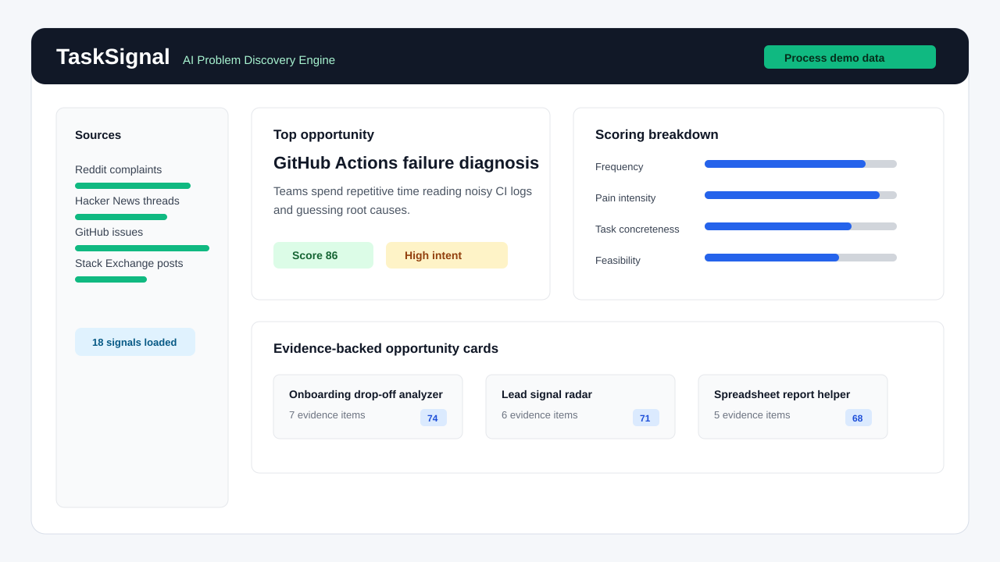
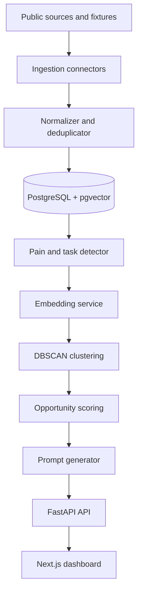

# TaskSignal - AI Problem Discovery Engine

From Reddit/forum complaints → evidence-backed project ideas → build-ready Codex prompts.

TaskSignal is an AI-assisted engine that mines public developer and community discussions, detects concrete repetitive tasks people complain about, clusters similar pain signals, scores software opportunities, and generates Codex-ready MVP prompts.



## Project Status

TaskSignal is a portfolio-ready MVP built by Yurii Bakurov. It is designed to run locally with fixture data out of the box, then expand into live API-backed research workflows when credentials are provided.

Useful starting points:

- [Product context](PRODUCT.md)
- [Architecture](docs/architecture.md)
- [API reference](docs/api.md)
- [Deployment notes](docs/deployment.md)
- [Data ethics](docs/data-ethics.md)
- [Model card](docs/model-card.md)
- [Contributing guide](CONTRIBUTING.md)
- [Security policy](SECURITY.md)

## Why This Exists

Most idea lists are generic. TaskSignal is a task-replacement radar: it looks for specific repeated workflows people hate doing, such as exporting Stripe data into a spreadsheet every Friday and turning it into a client report.

## What It Does

- Loads demo fixture data with no API keys.
- Normalizes Reddit, Hacker News, GitHub Issues, Stack Exchange, and fixture-style records.
- Stores author hashes instead of raw usernames by default.
- Detects complaints, manual workflows, tool requests, workarounds, buying intent, and confusion.
- Generates local embeddings with `sentence-transformers/all-MiniLM-L6-v2` when available.
- Falls back to deterministic local vectors when the model is unavailable.
- Clusters signals with DBSCAN plus a demo-safe thematic fallback.
- Scores opportunities using frequency, recency, pain, concreteness, buying intent, feasibility, and competition penalty.
- Generates opportunity cards and full Codex-ready build prompts.

## Architecture



## Tech Stack

Frontend: Next.js, TypeScript, Tailwind CSS, TanStack Query, Recharts, React Markdown, Zod-ready types.

Backend: FastAPI, Pydantic v2, SQLAlchemy 2, Alembic, PostgreSQL, pgvector, pytest, ruff, scikit-learn.

ML/NLP: sentence-transformers with local-only load, deterministic fallback vectors, DBSCAN clustering, rule-based signal detector.

Infra: Docker Compose, Makefile, GitHub Actions CI, scheduled ingestion template.

## Quickstart

```bash
cp .env.example .env
make up
```

Open the frontend at [http://localhost:3000](http://localhost:3000), go to Dashboard, and click **Process demo data**.

API health check:

```bash
curl http://localhost:8000/health
```

## Local Development

Run the API and frontend separately:

```bash
cd apps/api
uvicorn app.main:app --reload
```

```bash
cd apps/web
npm run dev
```

Run checks before publishing changes:

```bash
make test
make lint
```

## Repository Layout

```text
apps/api      FastAPI backend, ML pipeline, database models, tests
apps/web      Next.js dashboard, opportunity views, prompt export UI
data          Demo fixtures for local-first processing
docs          Architecture, API, deployment, ethics, and model notes
notebooks     Classifier training and evaluation workbooks
```

## Fixture Demo Mode

Fixture mode is the default. It loads records from `data/fixtures`, processes them end to end, and should generate at least five opportunity cards:

- AI-generated code audit tool
- Early-stage SaaS lead/community signal radar
- Simple onboarding drop-off analyzer
- GitHub Actions workflow debugging assistant
- Spreadsheet-to-report automation helper

## API Connector Setup

Real connectors are implemented behind environment variables:

- `REDDIT_CLIENT_ID`, `REDDIT_CLIENT_SECRET`, `REDDIT_USER_AGENT`
- `GITHUB_TOKEN`
- `STACK_EXCHANGE_KEY`

No paid LLM key is required. `LLM_PROVIDER=none` is the default.

## ML/NLP Approach

The MVP uses transparent rules first. It scores pain phrases, repetition phrases, tool requests, buying intent, and task concreteness hints. Embeddings use `sentence-transformers/all-MiniLM-L6-v2` only when locally available; otherwise deterministic vectors keep the demo working.

## Scoring Formula

```text
opportunity_score =
  0.25 * frequency_score
+ 0.20 * recency_score
+ 0.20 * pain_intensity_score
+ 0.15 * task_concreteness_score
+ 0.10 * buying_intent_score
+ 0.10 * feasibility_score
- 0.10 * competition_penalty
```

## Privacy And Ethics

TaskSignal is designed for public-data research, product discovery, and learning. It does not store raw usernames by default, preserves source URLs for attribution, respects API boundaries, and should not be used for spam or harassment workflows.

Before enabling live connectors, review [Data ethics](docs/data-ethics.md), configure API credentials through environment variables or GitHub repository secrets, and avoid committing `.env` files or exported datasets.

## Example Generated Opportunity

**Developers need clearer GitHub Actions failure diagnosis**

Problem: teams spend repetitive time reading noisy CI logs, searching YAML errors, and guessing root causes.

Suggested MVP: a CI log summarizer and workflow linter that identifies likely YAML mistakes, dependency failures, and next fixes.

## Example Generated Codex Prompt

```markdown
# Build Developers need clearer GitHub Actions failure diagnosis

You are a senior full-stack engineer. Build a working MVP...
```

## Portfolio Notes

This repository demonstrates full-stack engineering, API design, Python backend development, TypeScript frontend development, PostgreSQL/pgvector modeling, ML/NLP pipelines, clustering, product scoring, privacy-conscious design, Docker, CI/CD, tests, and technical writing.

## Roadmap

- Add classifier training artifact loading.
- Add richer source scheduling and rate-limit state.
- Add pgvector ANN search in production mode.
- Add optional Ollama summary improvement.
- Add reviewer workflow for human labels.
