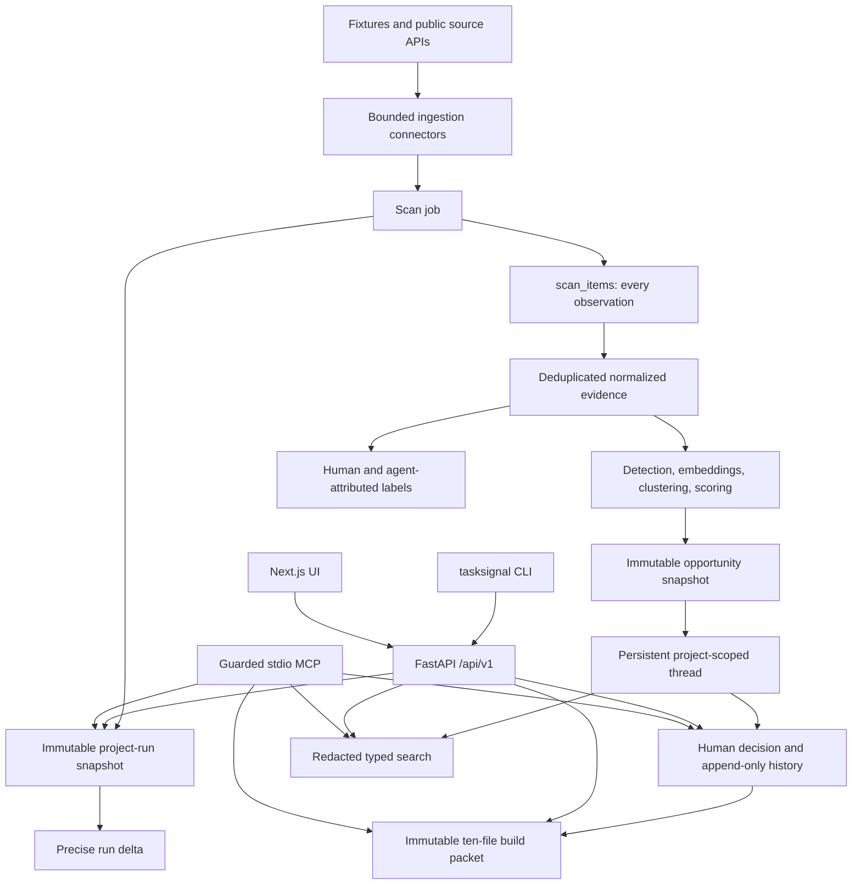

# Architecture

TaskSignal is a local-first evidence-to-build workbench for one operator. The
same typed backend services support REST, the packaged CLI, the Next.js UI, and
the guarded stdio MCP surface.

## System Shape



The Python distribution contains the FastAPI application, CLI, public fixtures,
and Alembic revisions. Its internal package remains named `app`; consumers use
the `tasksignal` command and REST/MCP contracts rather than importing `app` as a
public library. The wheel does not contain Node.js or the Next.js interface.

## Module Responsibilities

- `services/ingestion`: normalized connector contracts, fixture loader, live
  connectors, author minimization, and safe connector failure handling.
- `services/discourse_sources`: exact-origin terms authorization, readiness,
  retry state, and sanitized failure snapshots for public Discourse forums.
- `services/research_memory`: immutable run history, all-observation lineage,
  and precise run-delta calculation.
- `services/detection`, `embeddings`, `clustering`, and `scoring`: transparent
  evidence-to-opportunity processing. Deterministic fallbacks are the default.
- `services/opportunity_threads`: project-scoped thread matching, immutable
  snapshot linkage, append-only decision events, and detach correction.
- `services/search`: one typed, redacted semantic retrieval contract shared by
  REST, CLI, and MCP.
- `services/evidence_review`: human/agent label separation, evidence readiness,
  and selection-biased evaluation summaries.
- `services/build_packets`: deterministic artifact generation, public-data
  redaction, manifesting, hashing, ZIP generation, and integrity verification.
- `services/agent_sessions` and `agent_actions`: process leases, capabilities,
  optimistic concurrency, idempotency, and append-only redacted audit records.
- `services/mcp_surface` and `mcp_server`: the fixed read/write/resource contract
  and stdio transport adapter.
- `workers.scan_pipeline`: synchronous scan orchestration. v1 does not add a
  background job framework.
- `api`: canonical `/api/v1` routes plus `/api` compatibility aliases.
- `apps/web`: the source-checkout Next.js operator UI for projects, run deltas,
  threads, Build Studio, Discourse authorization, sessions, and audit.

## Research Memory

`research_project_runs` snapshots the configured source, exact public origin
when applicable, query, requested limit, scan, sequence, and lineage state.
`scan_items` records every normalized item observed by a scan, including items
already present in the evidence store. This separates observation history from
evidence deduplication.

Only missing evidence records need normalization-time persistence, detection,
and embedding. Clustering for a run can still use every signal-bearing item it
observed. An identical rerun therefore adds a run/observation audit trail while
adding zero evidence and avoiding a false new opportunity thread.

Run deltas use stable source identity and content hashes. `not observed this
run` is an observation statement, never a deletion or resolution statement.
Legacy v0.2 runs that lack complete lineage remain `untracked`; timestamps are
not used to invent history.

## Opportunity Thread Matching

Threads own persistent decision state. Opportunity rows are immutable snapshots
attached to a thread. Candidates are limited to the same research project.

An exact evidence-set hash matches immediately when it identifies one candidate.
Otherwise a candidate is comparable only when its embedding model and backend
identifiers match the incoming snapshot. The weighted score is:

```text
0.60 * centroid similarity
+ 0.25 * evidence Jaccard
+ 0.15 * normalized-title Jaccard
```

A score `>= 0.82` auto-matches only when the next candidate is at least `0.05`
lower. Multiple exact matches, a narrow margin, incompatible embeddings, or a
below-threshold score create a new thread. The snapshot stores its method,
confidence, margin, component scores, evidence/content hashes, and embedding
identity. A human can detach an incorrectly auto-matched snapshot; the correction
is recorded as an append-only decision event.

## Build Packet Boundary

Packet creation snapshots the eligible thread, current opportunity, evidence,
readiness, latest decision event, and lineage hashes. It then generates nine
deterministic artifacts and a manifest. Before commit, the service locks and
revalidates the thread version, current snapshot, decision state, sensitive-risk
state, readiness, and source signature. A concurrent change produces `409`
rather than a packet based on stale eligibility.

The packet record is immutable. The manifest includes source and decision hashes,
IDs, generation metadata, UTF-8 byte counts, and SHA-256 hashes for the nine
artifacts. `MANIFEST.json` is stored with a separate digest instead of recursively
hashing itself. Download runs verification first.

Configured AI can generate validated `enhanced/` variants of selected planning
documents. It never replaces deterministic originals; failures record fallback
metadata. Evidence is quoted and labeled untrusted before either deterministic
or model-backed generation.

## Agent Session Boundary

The MCP transport is stdio only. One process creates one high-entropy raw secret,
keeps it in memory, and stores only its hash with the session. Reads do not need
approval. Writes require approval for the complete six-tool standard write set,
an idempotency key, an expected version, a live lease, and the appropriate
capability. Configured-AI packet generation adds a separately approved
`use_configured_ai` capability.

The process heartbeats every 30 seconds and receives a 60-second lease. Revoke,
expiry, or exit is terminal. Each attempted write appends redacted lifecycle
events with correlation and operation IDs. Agent evidence labels retain session
provenance but remain excluded from human-confirmed readiness and precision.

## Storage and Migrations

Packaged mode defaults to a platform-specific private data directory and SQLite.
`tasksignal init` creates a permission-`0600` config containing generated
secrets; environment variables override it. `tasksignal migrate` uses packaged
Alembic resources, creates a timestamped private SQLite backup before upgrade,
and refuses unknown or nonempty unversioned schemas unless the operator completes
the explicit inspect/fingerprint/stamp workflow. `tasksignal serve` refuses a
stale schema and binds only to loopback.

Source checkout and container deployments can use PostgreSQL. Migration lineage
is still Alembic-controlled; table auto-creation is not a substitute for an
upgrade.

## Deployment Boundaries

The supported product boundary is one local operator:

- native packaged mode: Python 3.11–3.14 on macOS or Linux;
- Windows: WSL-only for v1;
- full UI: source checkout or a versioned container image when published;
- hosted mode: protected single-operator preview only.

Accounts, tenancy, team collaboration, private sources, HTTP MCP/OAuth,
background job infrastructure, automatic GitHub writes, third-party connector
plugins, and deletion through MCP are outside v1.
