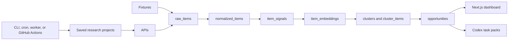
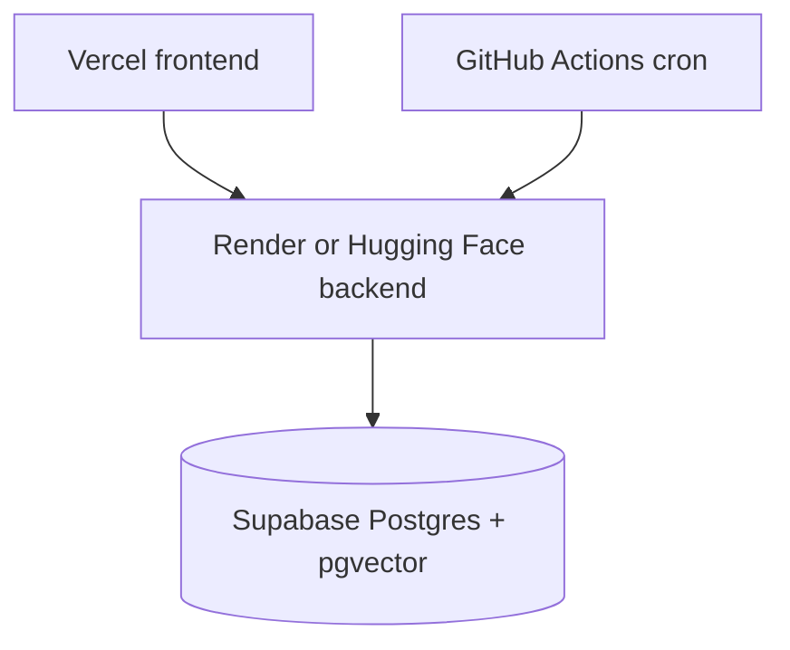

# Architecture

TaskSignal is a local-first full-stack app with fixture data, optional live connectors, saved research workflows, and agent handoff exports.

## Module Responsibilities

- `services/ingestion`: connector interface, fixture loader, live source connectors, normalization, deduplication.
- `services/detection`: rule-based problem signal detection and evidence span extraction.
- `services/embeddings`: sentence-transformer embeddings when a local model cache exists, with deterministic fallback.
- `services/clustering`: local thematic clustering fallback by default, with optional DBSCAN when `TASKSIGNAL_USE_SKLEARN_CLUSTERING=1`.
- `services/scoring`: opportunity score components and explanation.
- `services/generation`: deterministic opportunity cards, Codex prompt generation, and optional runtime-backed prompt enhancement.
- `workers`: process orchestration for fixture processing and explicit scan jobs.
- `workers.scan_pipeline`: synchronous live-source scan orchestration for one
  selected source/query/limit without a background job framework.
- `api`: FastAPI endpoints.
- `apps/web`: Next.js dashboard, saved research projects, integrations, and workflow UI.
- `skills/tasksignal-opportunity-builder`: Codex-style skill package for
  turning TaskSignal task packs into PRDs, issues, implementation plans, or
  evidence reviews.

## Data Flow

## Local Deployment

Docker Compose starts Postgres with pgvector, the FastAPI API, and the Next.js frontend. `AUTO_CREATE_TABLES=true` keeps the local MVP simple; Alembic migrations are included for production-style evolution.

Scheduling is explicit: the API stores `next_run_at` and `run_count`, while the
Projects page, CLI, cron, GitHub Actions, or another worker calls
`POST /api/research-projects/run-due`. The web process does not contain a hidden
background scheduler.

## Hosted Deployment

