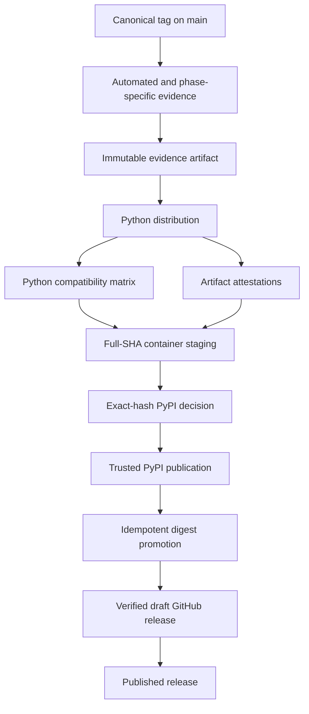

## Workflow Overview

**Purpose**: Publish one evidence-approved TaskSignal revision to PyPI, GHCR,
and GitHub with verifiable provenance and fail-closed recovery.

**Trigger Events**: Push of an exact canonical version tag.

**Target Environments**: Linux validation/publication, Linux and macOS Python
compatibility, multi-architecture Linux containers, protected `pypi` and
`release` environments.

## Execution Flow Diagram

## Jobs and Dependencies

| Job | Purpose | Dependencies | Privilege boundary |
|---|---|---|---|
| Validate | Prove tag, ancestry, product, migrations, security gates, and evidence | None | Read-only |
| Python distribution | Build deterministic wheel/sdist and product-rooted SBOM | Validate | Read-only |
| Python compatibility | Install exact wheel on supported Python/OS matrix | Distribution | Read-only |
| Python attestation | Attest downloaded artifacts and evidence manifest | Validate, distribution | OIDC and attestations only |
| Container staging | Build multi-architecture images at unique full-SHA staging refs | Compatibility, attestations | Protected GHCR write |
| PyPI decision | Compare local artifacts with any existing public version | Both staged images | Read-only |
| PyPI publication | Upload only a missing exact version | Decision, attestations | Protected PyPI OIDC |
| Container promotion | Promote exact digests to immutable version/full-SHA tags | Both staged images, PyPI | Protected GHCR write |
| GitHub release | Verify complete draft assets, then publish | All registries | Protected contents write |

## Requirements Matrix

### Functional Requirements

| ID | Requirement | Acceptance criteria |
|---|---|---|
| REQ-001 | Canonical release identity | Tag, Python, source fallback, lock, API, npm, and npm lock versions agree |
| REQ-002 | Exact-SHA evidence | Manifest records tag SHA, run URL, product digest, every evidence hash, SQLite and PostgreSQL records |
| REQ-003 | Phase gates | RC/GA require product-bound Browser and accessibility reports; GA requires three distinct completed builder records |
| REQ-004 | Compatible wheel | Exact artifact passes Python 3.11-3.14 on Linux and macOS |
| REQ-005 | Recoverable publication | Existing immutable tags or PyPI files are accepted only on exact digest/hash equality |
| REQ-006 | Complete GitHub release | Draft assets and checksum inventory verify before publication |

### Security Requirements

| ID | Requirement | Constraint |
|---|---|---|
| SEC-001 | Least privilege | Workflow defaults to read-only; write scopes exist only in protected publication jobs |
| SEC-002 | Action integrity | Every action is pinned to a reviewed full commit SHA |
| SEC-003 | Build/OIDC separation | Repository build code never runs in the Python attestation or PyPI OIDC jobs |
| SEC-004 | Immutable identity | Container version and full-SHA tags cannot move to a different digest |
| SEC-005 | Evidence privacy | Builder IDs are opaque; reports exclude identities, secrets, and private records |

## Input and Output Contracts

Inputs are the tagged repository revision, lockfiles, version metadata, public
fixtures, and phase-appropriate manual evidence. Outputs are the exact Python
artifacts, product-rooted CycloneDX SBOM, release evidence manifest, image digest
records, attestations, PyPI release, GHCR aliases, and a verified GitHub release.

No long-lived registry token is accepted. PyPI uses environment-bound OIDC;
GHCR and GitHub use the job-scoped workflow token.

## Error and Recovery Contract

| Failure | Required behavior |
|---|---|
| Invalid/off-main tag | Stop before artifact creation |
| Missing or stale RC/GA evidence | Stop before external writes |
| One container staging failure | Do not promote either release tag |
| Existing immutable tag differs | Fail; never overwrite |
| Existing PyPI version differs | Fail; never skip a mismatch |
| Exact PyPI rerun | Skip upload and continue |
| GitHub asset upload failure | Leave a draft; retry only matching assets and upload only missing files |
| Published release rerun | Succeed only when remote assets and phase match exactly |

## Quality Gates

There is no automated bypass for repository verification, audits, package
installation, supported-runtime compatibility, evidence integrity, migration
rehearsal, RC/GA Browser/accessibility evidence, or GA independent-builder
evidence. Environment approval is additional authorization, not a substitute.

## External Configuration

Repository administrators must configure required reviewers, prevent
self-review and administrator bypass where available, restrict deployment
branches/tags, configure the exact PyPI Trusted Publisher workflow/environment,
enable immutable GitHub Releases, and protect release tags. These controls are
not expressible completely in workflow YAML and must be verified before the
first external publication.

## Validation Criteria

- Actionlint accepts the workflow.
- The repository policy check rejects mutable action refs or missing top-level
  permissions.
- Unit tests cover canonical phases, off-main refusal, evidence tampering,
  product drift, GA builder count, SBOM identity, and PyPI exact-hash recovery.
- A live dry run records environment approvals and verifies final registry
  digests/assets at the candidate SHA.

## Related Specifications

- `spec/spec-process-cicd-tasksignal-release-quality.md`
- `docs/release-prep.md`
- `release-evidence/README.md`
