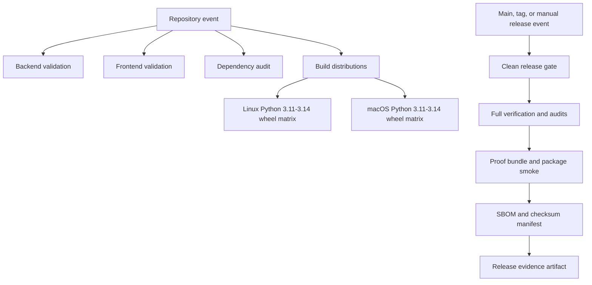

## Workflow Overview

**Purpose**: Prove that one TaskSignal revision is testable, dependency-audited,
installable from built artifacts, and capable of producing immutable release
evidence without publishing it.

**Trigger Events**: CI runs for pushes, pull requests, and manual dispatch.
Release readiness runs for the default branch, version tags, and manual
dispatch.

**Target Environments**: Linux for core validation and Python 3.11-3.14 wheel
compatibility; macOS for the same Python 3.11-3.14 packaged-path, permission,
migration, CLI, and base/MCP boundary matrix.

This specification describes configured jobs. Cross-platform evidence is not
complete until every required matrix leg passes for the candidate revision.

## Execution Flow Diagram



## Jobs & Dependencies

| Job Name | Purpose | Dependencies | Execution Context |
|---|---|---|---|
| Backend | Validate repository hygiene, API lint, and API tests | Locked API dependency graph | Linux, representative Python |
| Frontend | Validate locked install, audit, build, and tests | Locked web dependency graph | Linux, supported Node |
| Python dependency audit | Reject known vulnerabilities in base and MCP dependency closure | API lockfile | Linux |
| Package build | Build and validate wheel and source distribution | Package metadata and packaged resources | Linux, representative Python |
| Linux package smoke | Install and exercise the built wheel across supported Python versions | Package build artifact | Linux, Python 3.11-3.14 |
| macOS package smoke | Validate macOS paths, permissions, base/MCP boundary, and packaged resources | Package build artifact | macOS, Python 3.11-3.14 |
| Release evidence | Produce verified, immutable release-review evidence at one revision | All repository release inputs | Linux, main/tag/manual only |

## Requirements Matrix

### Functional Requirements

| ID | Requirement | Priority | Acceptance Criteria |
|---|---|---|---|
| REQ-001 | Validate API and web behavior | High | All lint, test, build, and release-content checks pass |
| REQ-002 | Test the built wheel rather than the checkout | High | Smoke runs from a temporary directory and imports only the isolated install |
| REQ-003 | Support Python 3.11-3.14 | High | One Linux and one macOS matrix leg pass for every supported minor version |
| REQ-004 | Validate macOS packaged mode | High | Python 3.11-3.14 each pass path, permission, migration, CLI, and base/MCP smoke |
| REQ-005 | Preserve the MCP optional boundary | High | Base install has no MCP; extra install imports MCP and the TaskSignal server |
| REQ-006 | Verify packaged runtime resources | High | Fixtures and Alembic revisions are readable from the wheel |
| REQ-007 | Produce release evidence | High | Proof manifest, audits, distributions, SBOM, and verified hashes are uploaded |
| REQ-008 | Document Windows scope | Medium | v1 documentation states WSL-only support and no native Windows CI claim |

### Security Requirements

| ID | Requirement | Implementation Constraint |
|---|---|---|
| SEC-001 | Use least-privilege workflow credentials | Verification workflows receive read-only repository permission |
| SEC-002 | Reject known dependency vulnerabilities | npm and Python audits fail at configured release thresholds |
| SEC-003 | Prevent secret disclosure | Generated configuration remains permission `0600`; CLI output is checked against generated secret values |
| SEC-004 | Prevent accidental publication | Verification jobs have no package registry or container registry credentials and perform no publish operation |
| SEC-005 | Preserve artifact integrity | Release files receive SHA-256 hashes that are verified before upload |

### Performance Requirements

| ID | Metric | Target | Measurement Method |
|---|---|---|---|
| PERF-001 | Pull-request critical path | Under 30 minutes in normal hosted-runner conditions | GitHub job duration |
| PERF-002 | Stale run use | Zero continued execution after replacement where cancellation is supported | Concurrency cancellation state |
| PERF-003 | Dependency reuse | Lockfile-keyed caches on dependency-heavy validation jobs | Workflow cache telemetry |

## Input/Output Contracts

### Inputs

```yaml
repository_revision: immutable Git SHA
api_lockfile: apps/api/uv.lock
web_lockfile: apps/web/package-lock.json
release_metadata: package versions and CHANGELOG heading
manual_dispatch: optional maintainer trigger
```

### Outputs

```yaml
python_distributions: wheel, source distribution, SHA256SUMS
release_readiness_artifact: proof bundle, audits, SBOM, distributions, checksums
job_statuses: pass or fail for each independent quality gate
```

### Secrets & Variables

No repository secret is required. Tool-version constants are non-secret workflow
configuration. Publishing credentials are prohibited from these workflows.

## Execution Constraints

### Runtime Constraints

- Jobs have explicit timeouts.
- Independent test, audit, frontend, and package-build jobs may run in parallel.
- Wheel matrix jobs start only after one distribution artifact is built.
- New runs cancel stale runs for the same workflow and ref.

### Environmental Constraints

- Hosted Linux and macOS runners require public dependency-index access.
- SQLite test databases use runner-temporary absolute paths.
- Native Windows runners are intentionally excluded for v1; WSL uses the Linux
  support contract.

## Error Handling Strategy

| Error Type | Response | Recovery Action |
|---|---|---|
| Lock drift | Fail before tests or audit | Regenerate and review the lockfile |
| Test/build failure | Fail the owning job | Reproduce with the matching local Make target |
| Dependency advisory | Fail the audit job | Upgrade, replace, or explicitly review the dependency before release |
| Missing wheel resource | Fail isolated smoke | Correct package inclusion and rebuild |
| Manifest mismatch | Fail release evidence | Regenerate proof from the exact candidate revision |
| Hosted-runner/network fault | Fail without publication | Rerun after distinguishing infrastructure failure from deterministic failure |

## Quality Gates

| Gate | Criteria | Bypass Conditions |
|---|---|---|
| Repository quality | API/web verification and release metadata pass | None for release candidates |
| Dependency safety | npm and Python audits pass | None without a documented, separately reviewed policy change |
| Distribution quality | Build, metadata check, isolated install, and resource checks pass | None for package releases |
| Compatibility | Linux and macOS Python 3.11-3.14 matrices pass | None for v1 package releases |
| Evidence integrity | Proof manifest and release checksum manifest verify | None |
| GA readiness | Three independent builder flows are recorded | No automated bypass |

## Monitoring & Observability

### Key Metrics

- Job and matrix-leg success rate.
- Pull-request wall-clock time and total runner time.
- Dependency advisory count.
- Release artifact retention and checksum verification status.

### Alerting

| Condition | Severity | Notification Target |
|---|---|---|
| Required CI job fails | High | Pull request or commit status |
| Release evidence fails | High | Release-readiness run summary |
| Scheduled dependency audit unavailable | Medium | Job log and maintainer review |

## Integration Points

| System | Integration Type | Data Exchange | SLA Requirements |
|---|---|---|---|
| Python package index | Read-only dependency retrieval and advisory metadata | Package distributions and vulnerability records | Best effort; failure blocks the run |
| npm registry | Read-only dependency retrieval and advisory metadata | Locked packages and vulnerability records | Best effort; failure blocks the run |
| GitHub Actions artifacts | Evidence retention | Built distributions and release proof | Retained for the configured review window |

Publishing workflows for PyPI and GHCR are intentionally outside this
specification and require separate authorization, permissions, provenance, and
rollback design.

## Compliance & Governance

### Audit Requirements

- Release evidence names the exact candidate SHA and Actions run.
- The release bundle includes machine-readable dependency inventories and
  artifact hashes.
- Workflow changes require normal code review and a passing CI run.

### Security Controls

- Repository contents are read-only to the workflow token.
- No long-lived registry credentials are accepted.
- Generated local secrets remain inside temporary runner state and are never
  uploaded.

## Edge Cases & Exceptions

| Scenario | Expected Behavior | Validation Method |
|---|---|---|
| Base wheel accidentally gains MCP | Base smoke fails before extra installation | Isolated module-discovery assertion |
| Migration or fixture omitted | Package smoke fails | Installed distribution inventory check |
| Identical proof regenerated | Manifest verification remains deterministic | Proof verifier and SHA-256 checks |
| Tag points to mismatched metadata | Release-content check fails | Cross-metadata version check |
| Native Windows requested | Unsupported for v1; use WSL | Documented support boundary |

## Validation Criteria

- **VLD-001**: Workflow YAML parses and all referenced action majors exist.
- **VLD-002**: Local lint accepts CI helper scripts.
- **VLD-003**: A locally built wheel passes the isolated base/MCP smoke.
- **VLD-004**: Locked dependency export is accepted by the Python audit tool.
- **VLD-005**: Release proof manifest and aggregate checksums verify.
- **VLD-006**: Live CI confirms every Linux matrix leg and the macOS leg.

## Change Management

1. Update this specification when support or release gates change.
2. Review workflow permissions, trigger scope, and matrix impact.
3. Implement the smallest workflow and helper changes.
4. Run local component checks, then validate with GitHub Actions.
5. Record any remaining platform or external-service limitation.

### Version History

| Version | Date | Changes | Author |
|---|---|---|---|
| 1.0 | 2026-07-11 | Initial v1 CI and release-quality contract | TaskSignal Maintainers |

## Related Specifications

- `docs/release-prep.md`
- `docs/packaged-installation.md`
- `docs/superpowers/plans/2026-07-11-tasksignal-v1-local-evidence-to-build.md`
